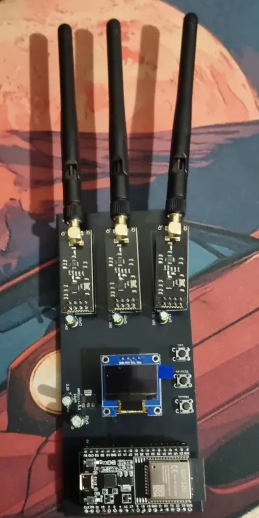

#  ESP32_Jammer - 2.4GHz ESP32 Jammer Tool

⚠️ **DISCLAIMER:** Acest proiect a fost creat STRICT în scopuri educaționale și pentru testarea securității rețelelor (penetration testing) în medii controlate, cu autorizație. Utilizarea dispozitivelor de bruiaj (jammers) în spații publice sau asupra echipamentelor care nu îți aparțin este ilegală în majoritatea țărilor. Autorul nu își asumă responsabilitatea pentru utilizarea abuzivă a acestui cod.

##  Descriere
[cite_start]Acest proiect transformă un ESP32 într-un instrument de testare radio pe frecvența de 2.4GHz[cite: 8, 69]. [cite_start]Dispozitivul controlează **trei module NRF24L01 simultan**  [cite_start]pentru a inunda canalele cu un semnal constant, putând astfel să bruieze conexiuni Wi-Fi, Bluetooth sau semnalele telefoanelor/dronelor[cite: 6]. 

[cite_start]Aparatul este dotat cu un ecran OLED [cite: 3] [cite_start]și un sistem de navigare cu 3 butoane [cite: 4] care îți permite să selectezi tipul de atac direct de pe dispozitiv. [cite_start]Pentru a concentra toată puterea pe modulele radio, interfețele native Wi-Fi și Bluetooth ale ESP32-ului sunt dezactivate automat din cod[cite: 91, 92].

##  Funcționalități Principale (Meniu)
* [cite_start]**BT Jammer:** Bruiază canalele Bluetooth (frecvențe/canale random până la 80)[cite: 19].
* [cite_start]**Drone Jammer:** Lansează interferențe pe canalele specifice dronelor (până la 125)[cite: 21].
* [cite_start]**WiFi Jammer:** Vizează canalele principale Wi-Fi (1, 6 și 14)[cite: 24].
* [cite_start]**Multi Ch Jam:** Atac combinat/multi-canal pe 2.4GHz[cite: 88].

## Hardware Necesar
* Microcontroller **ESP32**
* **3 x Module radio NRF24L01** (conectate prin VSPI)
* **3 x Condensatoare 10µF** (lipite direct pe pinii de alimentare ai fiecărui modul NRF24L01 pentru stabilitate)
* **Regulator de tensiune AMS1117** (pentru a asigura curentul necesar modulelor radio)
* **Condensatoare 47µF** (pentru filtrarea pe regulatorul AMS1117 - *notă: funcționează foarte bine și cu 20µF*)
* **Display OLED 128x64** (I2C, adresă `0x3C`, driver SSD1306)
* **3 x Butoane** (conectate la pinii 14 [UP], 12 [DOWN], 13 [SELECT])

##  Tehnologii și Librării
Pentru a compila acest cod, vei avea nevoie de următoarele librării instalate în Arduino IDE:
* [cite_start]`RF24` (pentru modulele NRF24) [cite: 1]
* [cite_start]`Adafruit_GFX` și `Adafruit_SSD1306` (pentru ecranul OLED) [cite: 1]
* [cite_start]`U8g2_for_Adafruit_GFX` (pentru fonturi și UI) [cite: 1]

##  Instalare și Rulare
1. Clonează acest repository.
2. Deschide fișierul `.ino` în Arduino IDE.
3. Asigură-te că ai instalat toate librăriile menționate mai sus din *Library Manager*.
4. Selectează placa ta ESP32 din meniul *Tools* și portul corect.
5. Apasă *Upload*.
6. [cite_start]Odată pornit, vei vedea logo-ul de boot ("demonSHIT" / Cypher Box) [cite: 67, 74][cite_start], urmat de un mesaj de întâmpinare [cite: 76][cite_start], iar apoi vei intra în meniul principal[cite: 94]. Folosește butoanele pentru a naviga.

##  Sursa Originală
Acest proiect a fost dezvoltat pornind de la codul original creat de [Divine Zeal](https://github.com/dkyazzentwatwa). Îi mulțumesc pentru sursa de inspirație și logica din spate!

##  Contact
raulradocea@gmail.com
