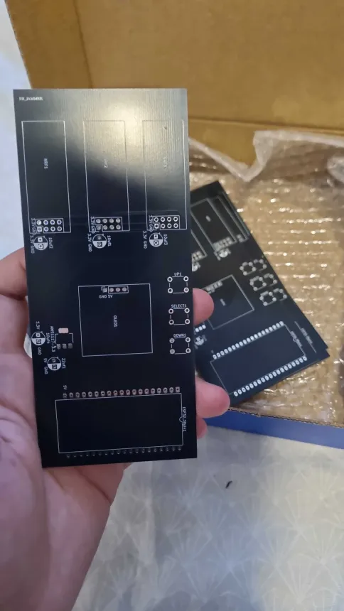
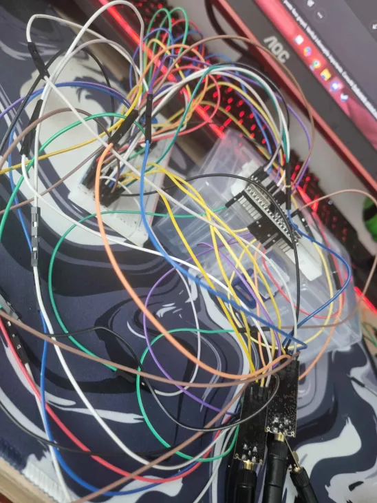
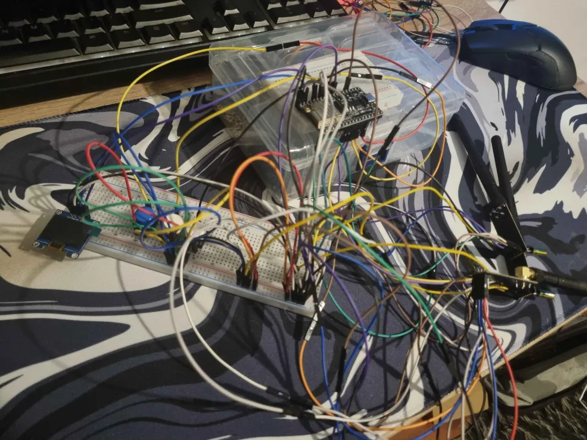

#  ESP32_Jammer - 2.4GHz ESP32 Jammer Tool

🌍 *[Read this documentation in English](README_en.md)*

⚠️ **DISCLAIMER:** Acest proiect a fost creat STRICT în scopuri educaționale și pentru testarea securității rețelelor (penetration testing) în medii controlate, cu autorizație. Utilizarea dispozitivelor de bruiaj (jammers) în spații publice sau asupra echipamentelor care nu îți aparțin este ilegală în majoritatea țărilor. Autorul nu își asumă responsabilitatea pentru utilizarea abuzivă a acestui cod.

##  Descriere
Acest proiect transformă un ESP32 într-un instrument de testare radio pe frecvența de 2.4GHz.Dispozitivul controlează **trei module NRF24L01 simultan**  pentru a inunda canalele cu un semnal constant, putând astfel să bruieze conexiuni Wi-Fi, Bluetooth sau semnalele dronelor. 

Dispozitivul este dotat cu un ecran OLED și un sistem de navigare cu 3 butoane care îți permite să selectezi tipul de atac direct de pe dispozitiv. Pentru a concentra toată puterea pe modulele radio, interfețele native Wi-Fi și Bluetooth ale ESP32-ului sunt dezactivate automat din cod.

##  Funcționalități Principale (Meniu)
* **BT Jammer:** Bruiază canalele Bluetooth (frecvențe/canale random până la 80).
* **Drone Jammer:** Lansează interferențe pe canalele specifice dronelor (până la 125).
* **WiFi Jammer:** Vizează canalele principale Wi-Fi (1, 6 și 14).
* **Multi Ch Jam:** Atac combinat/multi-canal pe 2.4GHz.

## Hardware Necesar
* Microcontroller **ESP32**
* **3 x Module radio NRF24L01** (conectate prin VSPI)
* **3 x Condensatoare 10µF** (lipite direct pe pinii de alimentare ai fiecărui modul NRF24L01 pentru stabilitate)
* **Regulator de tensiune AMS1117** (pentru a asigura curentul necesar modulelor radio)
* **Condensatoare 47µF** (pentru filtrarea pe regulatorul AMS1117 - *notă: funcționează foarte bine și cu 20µF*)
* **Display OLED 128x64** (I2C, adresă `0x3C`, driver SSD1306)
* **3 x Butoane** (conectate la pinii 14 [UP], 12 [DOWN], 13 [SELECT])

##  Tehnologii și Librării
Pentru a compila acest cod, vei avea nevoie de următoarele librării instalate în Arduino IDE:
* `RF24` (pentru modulele NRF24) 
* `Adafruit_GFX` și `Adafruit_SSD1306` (pentru ecranul OLED
* `U8g2_for_Adafruit_GFX` (pentru fonturi și UI) 

##  Instalare și Rulare
1. Clonează acest repository.
2. Deschide fișierul `.ino` în Arduino IDE.
3. Asigură-te că ai instalat toate librăriile menționate mai sus din *Library Manager*.
4. Selectează placa ta ESP32 din meniul *Tools* și portul corect.
5. Apasă *Upload*.
6. Odată pornit, vei vedea logo-ul de boot ("demonSHIT" / Cypher Box), urmat de un mesaj de întâmpinare, iar apoi vei intra în meniul principal. Folosește butoanele pentru a naviga.

## Schema de Conectare (Pinout)

**Alimentare (Foarte Important):**
Modulele NRF24L01 consumă mult curent. Tensiunea de 3.3V a ESP32-ului nu este suficientă pentru 3 module simultan. 
* Folosește pinul `VIN` (5V) al ESP32 pentru a alimenta regulatorul **AMS1117**.
* Ieșirea de 3.3V a regulatorului AMS1117 va alimenta cele 3 module radio.
* Pune condensatoarele de **47µF** (sau 20µF) pe intrarea/ieșirea regulatorului.
* Lipește câte un condensator de **10µF** direct pe pinii de VCC/GND ai fiecărui modul NRF24.

**Conexiuni SPI (Comune pentru toate cele 3 module NRF24):**
Toate cele 3 module se leagă în paralel la pinii VSPI ai ESP32-ului:
* **MOSI** -> Pin 23
* **MISO** -> Pin 19
* **SCK** -> Pin 18

**Conexiuni Specifice CE / CSN (Pentru a le controla separat):**
| Modul | Pin CE | Pin CSN |
|-------|--------|---------|
| Radio 1 | Pin 27 | Pin 15 |
| Radio 2 | Pin 26 | Pin 25 |
| Radio 3 | Pin 17 | Pin 5 |

**Display OLED & Butoane:**
| Componentă | Pin ESP32 |
|------------|-----------|
| OLED SDA | Pin 21 (Default I2C) |
| OLED SCL | Pin 22 (Default I2C) |
| Buton UP | Pin 14 (Conectat la GND) |
| Buton DOWN | Pin 12 (Conectat la GND) |
| Buton SELECT| Pin 13 (Conectat la GND) |

⚠️ **Notă importantă despre compatibilitate (Erori de compilare):** Dacă întâmpini erori atunci când încerci să compilezi codul, problema este cel mai probabil cauzată de versiunile noi ale pachetului ESP32 sau ale librăriilor. 
* Este recomandat să faci **downgrade** la pachetul de plăci **esp32 by Espressif Systems** din *Boards Manager* (de preferat la o versiune stabilă din seria `2.0.x`, cum ar fi `2.0.14` sau `2.0.17`, deoarece versiunile `3.x` aduc schimbări majore care pot rupe compatibilitatea).
* De asemenea, dacă folosești cele mai noi versiuni ale librăriilor (în special `RF24` sau `Adafruit_GFX`), și acestea pot necesita un downgrade la o versiune anterioară dacă erorile persistă.

## Evoluția Proiectului (Behind the Scenes)

Înainte de a ajunge la varianta finală și curată de pe PCB, "Cypher Box" a început ca un prototip pe breadboard. A fost un "spaghetti de fire" la început pentru a testa comunicarea SPI simultană cu cele 3 module NRF24L01 și alimentarea din AMS1117, dar a meritat efortul!

*(Faza de testare pe breadboard)*

*(Primele teste cu ecranul OLED)*

##  Sursa Originală
Acest proiect a fost dezvoltat pornind de la codul original creat de [Divine Zeal](https://github.com/dkyazzentwatwa). Îi mulțumesc pentru sursa de inspirație și logica din spate!

##  Contact
raulradocea@gmail.com
